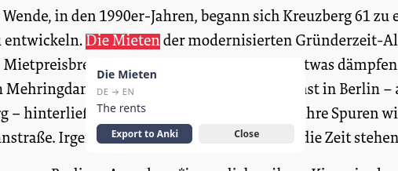
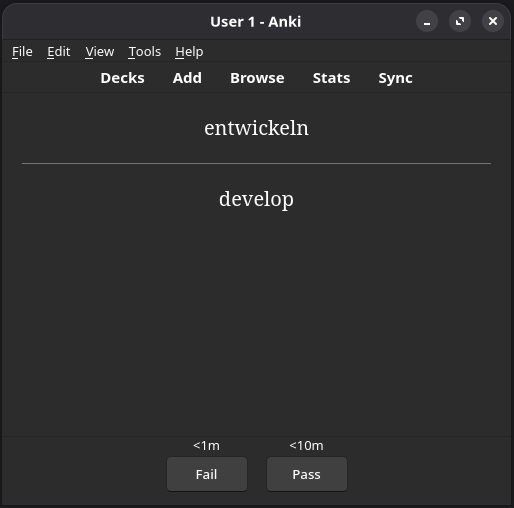
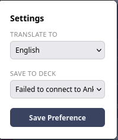

# noted
A firefox extension to automatically create anki flashcards for language learners

- Highlighted text is automatically translated using google translate
- Can be exported into anki deck

### Install Instructions

- [Click here](https://addons.mozilla.org/firefox/downloads/file/4917162/c1f1398fb6044338b7f7-1.1.xpi) to install the extension to browser
- Download the anki-connect extension `2055492159`
- Make sure anki is open while using the extension

### Basic Usage

- Click on the *noted* logo in the toolbar to select target Language and target Deck
- Highlight words and send to deck!

